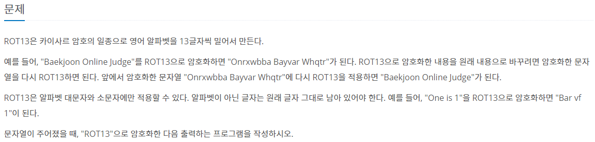
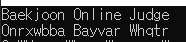
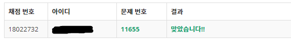

# ** ROT13 문제 풀어보기 **  

문제 링크 : https://www.acmicpc.net/problem/11655

오늘 풀어볼 문제는 ROT13이라는 문제로 일종의 암호문을 만드는 문제입니다.

먼저 문제를 먼저 보겠습니다.  
  

### * 문제 분석  

문자열을 입력받아 탐색하면서 해당 문자에 대해서 범위안에서 13의 인덱스 차이나는 문자로 변경하여 
암호화를 하는 문제인것 같습니다. 

### * 알고있어야 할 것  

  <ASCII 코드 인코딩에 정의된 값>  
      A ~ Z  ->  65 ~ 90  
      a ~ z  ->  97 ~ 122  

### * 해결 과정  

  1. 문자열을 입력 받는다.  
  2. 문자열을 탐색하면서 13의 인덱스를 더한다.
     만약 대문자일 경우에 13을 더했을 때 90이 넘으면 대문자 범위를 초과하므로 반대로 빼준다.   
     소문자일 경우에도 13을 더해서 122를 넘으면 반대로 빼준다.  
  3. 이 과정을 문자열 길이만큼 반복해준다.  
  4. 반복문이 끝나면 암호화 된 문자열을 출력해준다.  
  
### * C++ 코드  

#include <iostream>  
#include <string>  
using namespace std;  
  
int main(void)  
{  
    string s;  
    //getline() -> 공백까지 입력으로 받아 들이기 위해 사용  
    getline(cin, s);  
  
    //s의 길이가 100이 넘으면 조건에  
    //일치하지않으므로 종료  
    if (s.length() > 100)  
    {  
        exit(0);  
    }  
  
    for (int i=0;i<s.length();i++)  
    {  
        //대문자  
        if (s[i] >= 'A' && s[i] <= 'Z')  
        {  
            if (s[i] + 13 > 90)  
            {  
                s[i] -= 13;  
            }  
            else  
            {  
                s[i] += 13;  
            }  
        }  
  
        //소문자  
        else if (s[i] >= 'a' && s[i] <= 'z')  
        {  
            if (s[i] + 13 > 122)  
            {  
                s[i] -= 13;  
            }  
            else  
            {  
                s[i] += 13;  
            }  
        }  
    }  
  
    //결과 출력  
    cout << s;  
    return 0;  
}    
     
      
### * 결과   
  
  
  

감사합니다!  

  

  
